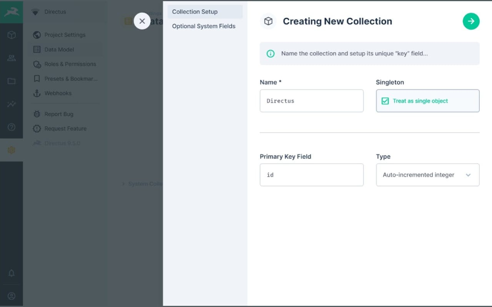

# Directus docker compose demo CI/CD pipeline

Example CI/CD pipeline showing how to deploy a direct instance to elestio.

 
 

# Once deployed ...

You can connect to the Directus Dashboard:

    Access URL: https://[CI_CD_DOMAIN]/
    Login: [ADMIN_EMAIL] (set in env var)
    Password: [ADMIN_PASSWORD] (set in env var)

# Note

By default, it is preloaded with version 9.26.0, and subsequent versions will be accompanied by a BSL license. For additional information on the Directus BSL license, you can check <a href="https://directus.io/bsl">here.</a> 
